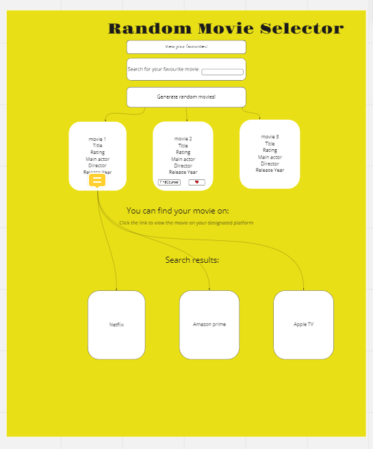

# RANDON MOVIE GENERATOR

## User Story

    As A movie lover
    I want to search movies or use random movie generator
    SO THAT I can watch good movies in desired platform or add as favourite

---

## Table of Contents

* [Description](#description)
* [Usage](#usage)
* [Technologie](#technologie)
* [Resources](#resources)

### Description

random movie generator is an application that will run in the browser and feature dynamically updated HTML and CSS. It  provides random movies or search favourite movies accordingly. The Application can add favourite movies on start page if added as favouite.

### Usage

* When the user visits the webpage--> They can press a button to generate 3 random movies or search for favourite movie
*  When the user clicks on one of the movies--> They are greeted with options for where to watch the movie (netflix, amazon etc.)
* When the user wants to search for a movie--> They can enter the movie name into a search bar
* When the user searches for their movie--> A search is performed and the results are shown to the user
* When the user clicks on the movie they searched for--> They are greeted with options for where to watch the movie
* When I open the movie generator dashboard--> Then I am presented with the last searched movies

### Technologies

* Interface AND DESIGN : html, Css, Buma

    [Buma is used for CSS Framework](https://bulma.io/ "Buma's Homepage") 

* Interaction: JavaScript
* Library : j query
* API: 

    [TMDB Movie API](https://www.themoviedb.org/documentation/api "TMDB Movie API's Homepage")

    [IMDB Movie API](https://imdb-api.com/api "IMDB Movie API's Homepage")

* [Trello is used for Project Management](https://trello.com/invite/b/uWfNU6Jj/dbaa1b00ce3ed5cd26aafa351f4ae53b/simple-project-board "Trello's Homepage")

* [Miro is used for creating Wireframe](https://miro.com/welcome/Vjl1WHNnZzI0NFpiNEpvU2ZIWVVPN0dSbE03cjlLZTVodUQ3ck9MZEpoUGlXRjZXS0pvZXRoVnp0TG5FSzNJa3wzNDU4NzY0NTI3ODMzNzgxNzg0?share_link_id=858178599018 "Miro's Homepage")

---

## Screenshots

Project Management by Trello

Wireframe by Miro

Actual frontend image

Actual frontend image after recommended movies are generated

---
## Links

[Git hub](https://github.com/Yoko-cyer/Movie-Generator "Github Homepage")

[Deployed Page](https://yoko-cyer.github.io/Movie-Generator/)

---

### Application made by Alice, Tim and Yoko